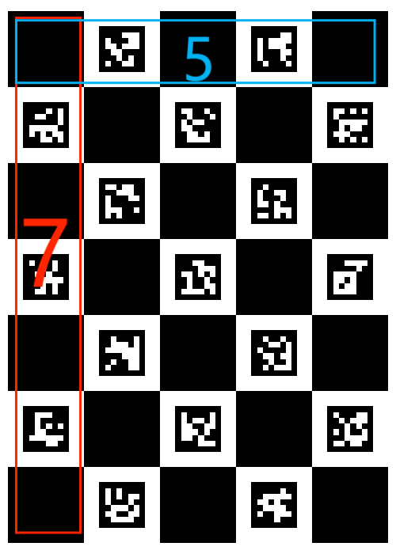
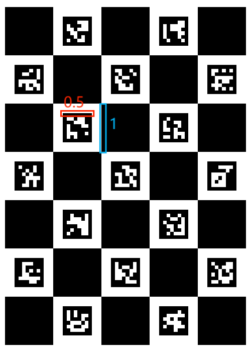
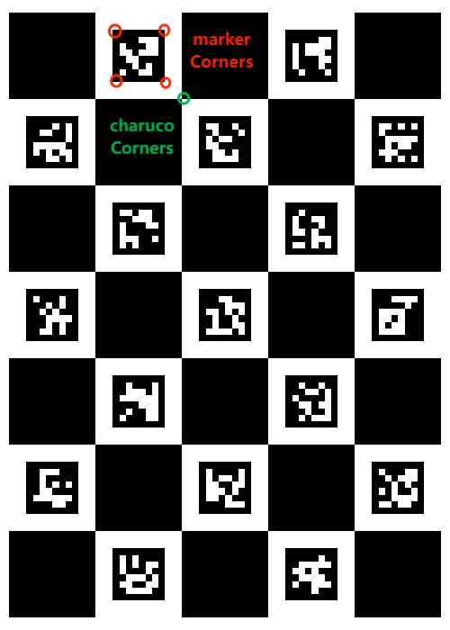

# A Python wrapper for OpenCV ArUco

This is a Python wrapper for OpenCV ArUco. It provides a simple interface to create and detect ArUco markers, ArUco boards, ChArUco boards, and ChArUco Diamond markers. It also includes functions to estimate the pose of the markers and boards.

I found it changes a lot in opencv 4.8, compared to 4.1, and off-the-shelf code is not working anymore. So I made some modifications to make it work with opencv 4.8.

## Requirements

- opencv 4.8
- numpy
  
I don't know if it works with earlier versions of opencv, and this project is developed and tested with opencv 4.8, *so it may be a good idea to use that version*, since as far as I know, Aruco of opencv 4.1 is quite different from 4.8. By the way,who konws what will happen in the future version of opencv.

## Getting started

You can run `demo_generate.py` to generate a sample image of a ChArUco board, and `demo_aruco.py` to detect and estimate the pose of the markers on the board. Besides, `demo_arucoboard.py` and `demo_charucoboard.py` have the similar function as `demo_aruco.py`

## Usage

In `aruco.py`, I define four classes: `aruco`, `ArucoBoard`, `CharucoBoard`, and `CharucoDiamond`. Each of them has same methods to ***create*** and ***detect*** markers, boards, and ***estimate the pose*** of the markers and boards, only the input parameters and output values are different.

Next sub-section, I will take charucoBoard as an example to explain how to use the wrapper.

### Create an Aruco Object

To use this wrapper, you need to import the `aruco` module like this:

```python
from aruco import charucoBoard
```

Then you can create a `CharucoBoard` object:

```python
# create charuco board in default
board = charucoBoard()

# you can costomize the dictionaryID, boardSize, and margin between Markers and Grids
board = charucoBoard(dictionary_id=cv2.aruco.DICT_6X6_250, board_size=(6, 5), marker_square_rate=0.7)
```

- `dictionary_id`: the id of the charuco dictionary, default is `cv2.aruco.DICT_6X6_50`, where
  - Marker size: `6x6` stands for the size of Aruco Markers dimension, larger the size, more markers the dictionary can contain.
  -  Dictionary size: `50` is the number of markers in the dictionary.
  - It's recommended to use **markers dimension as large as possible and dictionary size as small as possible** to get the best performance. From [Opencv Tutorial - Detection of ArUco Markers - Selecting a dictionary](https://docs.opencv.org/4.x/d5/dae/tutorial_aruco_detection.html) : smaller dictionary sizes and larger marker sizes increase the inter-marker distance and vice versa. However, the detection of markers with larger sizes is more difficult due to the higher number of bits that need to be extracted from the image.
- `board_size`: the size of the charuco board, default is `(5, 7)`.
- marker_square_rate: the size of the markers relative to the size of the charuco board grid, default is `0.5`.

### Detect Markers and Patterns

To detect markers and patterns, you can use the `detect` method of the `CharucoBoard` object:

```python
charucoCorners, charucoIds, markerCorners,
    markerIds = board.detect(img_to_be_detected)
```

input:
- `img_to_be_detected`: the image to be detected, should be in numpy array format.

output:
- `charucoCorners`: the corners of the charuco board, a numpy array with shape (N, 1, 2), each 1X2 array contains the corners of a charuco board, in pixel. The order of charucoConers is sorted by `charucoIds`, from small to large.
- `charucoIds`: the ids of the charuco board, a numpy array with shape (N, 1), each 1X1 array contains the id of a detected charuco board.
- `markerCorners`: the corners of the detected markers, a MX1 list of numpy arrays with shape (1, 4, 2). 
- `markerIds`: the ids of the markers, a numpy array with shape (M, 1), each 1X1 array contains the id of a detected marker.



### Estimate the Pose of Markers and Patterns

To estimate the pose of markers and patterns, you can use the `pose_estimate` method of the `CharucoBoard` object:

```python
pose = bd.pose_estimate(
                charucoCorners, charucoIds, intrinscis, distortion)
```

input:
- `charucoCorners`: reterned by `detect` method.
- `charucoIds`: returned by `detect` method.
- `intrinscis`: the intrinsics of the camera, a numpy array with shape (3, 3).
- `distortion`: the distortion of the camera, a numpy array with shape (1, 5).

output:
- `pose`: the pose of the markers and patterns, a dictionary containing key-value pairs:
  - `cameraMatrix`: the intrinsics of the camera, a numpy array with shape (3, 3), same as the input.
  - `distCoeffs`: the distortion of the camera, a numpy array with shape (1, 5), same as the input.
  - `rvec`: the rotation vector of the board, a numpy array with shape (3, 1).
  - `tvec`: the translation vector of the board, a numpy array with shape (3, 1).
> I have calibrated my KIKVISON webcam DS-E14a and store the intrinsics and distortion coefficients in folder `camera_params`. Intricis and distortion coefficients can be loaded from the file `camera_matrix.csv` and `distortion_coefficients.csv`. I tested the camera_params on another webcam and worked well. So use it directly may not get wrong if you don't have your own camera parameters.

### Draw the Markers and Patterns

To draw the markers and patterns, you can use the `draw` method of the `CharucoBoard` object:

```python
frame = bd.draw(frame, charucoCorners, charucoIds,
                        pose, axis_size=1.5)
```

input:
- `frame`: the image to be drawn, should be in numpy array format.
- `charucoCorners`: reterned by `detect` method.
- `charucoIds`: returned by `detect` method.
- `pose`: the pose of the markers and patterns, returned by `pose_estimate` method.
- `axis_size`: the size of the axis of the markers, default is `1`, you can adjust it to make the axis larger or smaller.

output:
- `frame`: the image with markers and patterns drawn, in numpy array format.


## Problems

There are still some problems sustaining the wrapper, such as:

- The charuco_diamond is not tested yet, I will do it when I have time.
- The pattern of `arucoBoard`, `charucoBoard`, and `charucoDiamond` can't be customized yet, but it seems a bug of opencv rather my code??? Luckily, default pattern is good enough for most cases.
- Comments are not well written, I will improve it in the future.

## License
This project is licensed under the Apache License 2.0. For more information, please see the [LICENSE](LICENSE.txt) file.

## Last Words

This is a simple wrapper for OpenCV ArUco, and it's still under development. 

I am a totally beginner in Python, so if you find any bug or have any better idea, please let me know.
It's my first time commit a project and if I haven't followed the rules of open source, please contact me, my e-mail is <EMAIL>1203819561@qq.com.com.
